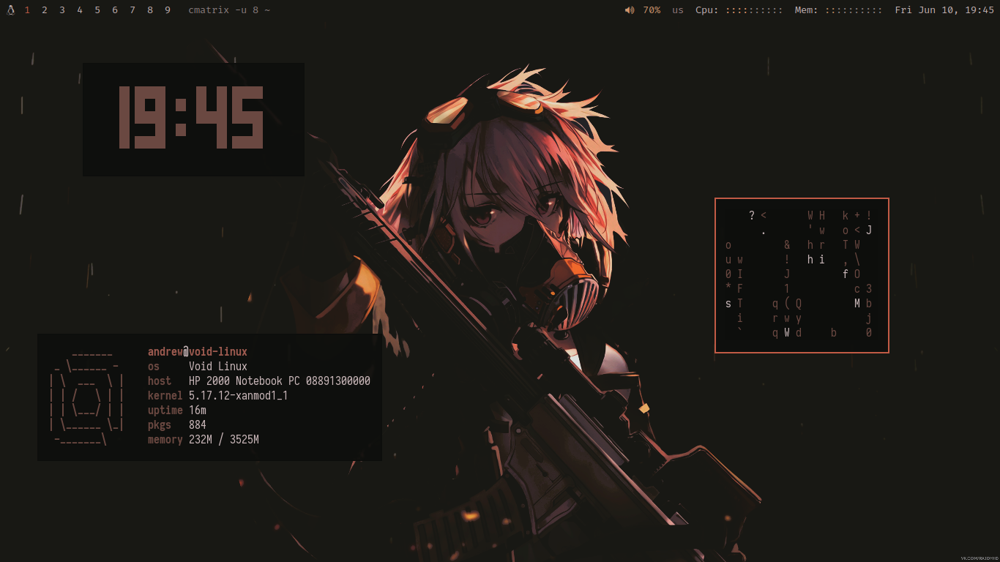

Colorscheme is generated with [pywal](https://github.com/dylanaraps/pywal) from the wallpaper

Original wallpaper: https://wallhaven.cc/w/lmm2p2

My darker version: https://anonfiles.com/12AbW6o6y9/bbwallhaven-lmm2p2.png

[This script](https://github.com/egeesin/alacritty-color-export) is used for adding the pywal colorscheme into the Alacritty terminal

NeoVim config coming soon
